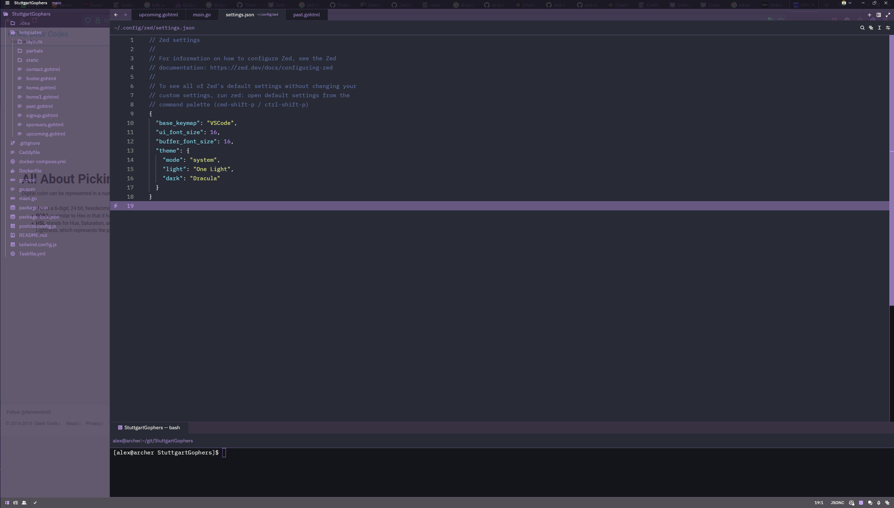

# zed-dracula-linux
Fix for transparent backgrounds in Zed on Linux: Dracula theme color palette with solid backgrounds

## Context
It is a known [issue/bug](https://github.com/zed-industries/zed/issues/17263S) in Linux, that some themes in Zed become transparent. Dracula theme is one of them. This settings.json file fixes this issue.

## Usage
Open the command palette (Ctrl+Shift+P) and type "Settings"
In the opened settings.json file, paste the content of the settings.json file in this repository.

## Before

## After

